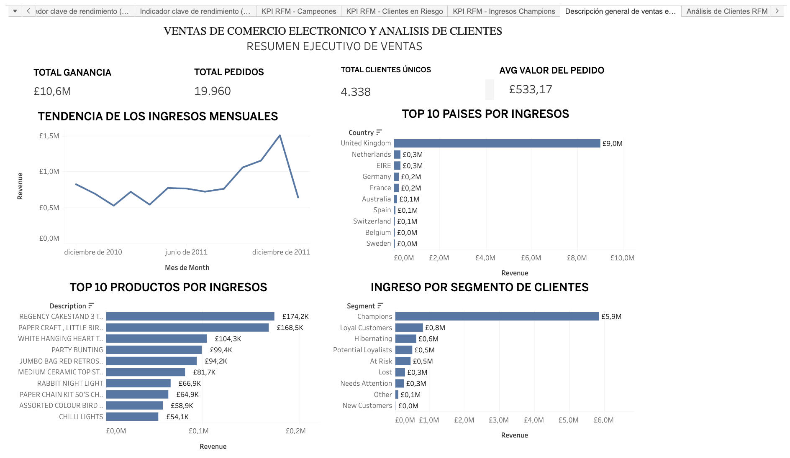
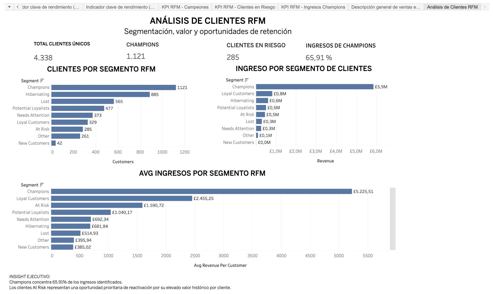

## 📊 Dashboard ejecutivo

El dashboard presenta una visión ejecutiva del desempeño comercial del E-Commerce, integrando los principales KPIs de ventas, evolución de ingresos, mercados con mayor contribución, productos destacados y distribución del revenue por segmento de clientes.

### Principales indicadores

- **Ingresos totales:** £10.6M
- **Pedidos:** 19,960
- **Clientes únicos:** 4,338
- **Valor promedio por pedido:** £533.17

---

## 👥 Análisis de clientes RFM

Se utilizó segmentación RFM para identificar grupos de clientes según su comportamiento y valor económico, permitiendo detectar segmentos prioritarios para estrategias de retención, fidelización y reactivación.

### Insights destacados

- **1,121 clientes** pertenecen al segmento Champions.
- Los **Champions concentran 65.91% de los ingresos identificados**.
- Se identificaron **285 clientes At Risk**.
- Los clientes At Risk mantienen un valor histórico relevante, por lo que representan una oportunidad prioritaria para estrategias de reactivación.

### 💡 Implicación de negocio

La elevada concentración de ingresos en Champions muestra la importancia de proteger y fidelizar este segmento. Paralelamente, los clientes At Risk representan una oportunidad para recuperar clientes de valor mediante campañas específicas de reactivación y retención.
